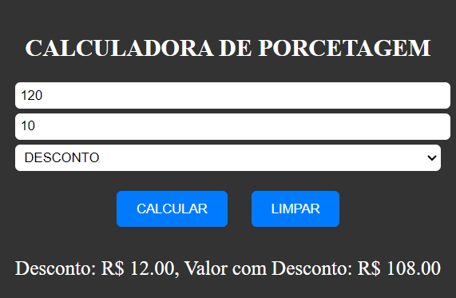

# CALCULAR PORCETAGEM
🆎CALCULADORA DE PORCETAGEM EM HTML, CSS E JS.

 <br>

## DESCRIÇÃO:
Este projeto consiste em uma calculadora de porcentagem que permite aos usuários calcular descontos ou aumentos com base em um valor inicial e uma porcentagem. Aqui estão as principais funcionalidades implementadas:

1. Inserir Valores:
   - Os usuários podem inserir o valor inicial no campo "VALOR" e a porcentagem no campo "PORCENTAGEM".

2. Selecionar Operação:
   - Os usuários podem escolher entre calcular um desconto ou um aumento selecionando a opção correspondente no menu suspenso.

3. Calcular:
   - Ao clicar no botão "CALCULAR", o sistema calculará o valor do desconto ou aumento com base nos valores inseridos e na operação selecionada e exibirá o resultado abaixo.

4. Limpar Campos:
   - O botão "LIMPAR" permite que os usuários limpem todos os campos, facilitando a entrada de novos valores.

## COMO USAR?
### BAIXANDO O PROJETO:
* Clone o repositório para o seu sistema local:

```bash
git clone https://github.com/VILHALVA/CALCULAR-PORCETAGEM.git
```

* Navegue até o diretório do projeto.

```bash
cd CALCULAR-PORCETAGEM
```

* Descompacte o arquivo ZIP (se você baixou manualmente):

```bash
unzip CALCULAR-PORCETAGEM.zip
```

* Abra o arquivo `CODIGO.html` em seu navegador de preferência.

### EXECUTANDO O PROJETO:
1. Inserir Valores:
   - Digite o valor original no campo "VALOR".
   - Digite a porcentagem de desconto ou aumento no campo "PORCENTAGEM".
   - Selecione o tipo de operação desejada (Desconto ou Aumento) no menu suspenso.

2. Calcular:
   - Clique no botão "CALCULAR" para calcular o valor do desconto ou aumento.
   - O resultado será exibido abaixo do botão, mostrando o valor do desconto/aumento e o novo valor calculado com base na operação selecionada.

3. Limpar Campos:
   - Se desejar limpar os campos de entrada e o resultado, clique no botão "LIMPAR".
   - Isso restaurará os campos de entrada para seus valores padrão e limpará a área de resultado.

## NÃO SABE?
- Entendemos que para manipular arquivos em `HTML`, `CSS` e outras linguagens relacionadas, é necessário possuir conhecimento nessas áreas. Para auxiliar nesse aprendizado, oferecemos cursos gratuitos disponíveis:
* [Curso de HTML e CSS](https://github.com/VILHALVA/CURSO-DE-HTML-E-CSS)
* [Curso de JavaScript](https://github.com/VILHALVA/CURSO-DE-JAVASCRIPT)
* [Confira mais cursos](https://github.com/VILHALVA?tab=repositories&q=+topic:CURSO)

## CREDITOS:
- [PROJETO CRIADO PELO VILHALVA](https://github.com/VILHALVA)
- [ESTÁ DISPONIVEL NO SITE](https://vilhalva.github.io/STYLER/STYLER.html)

